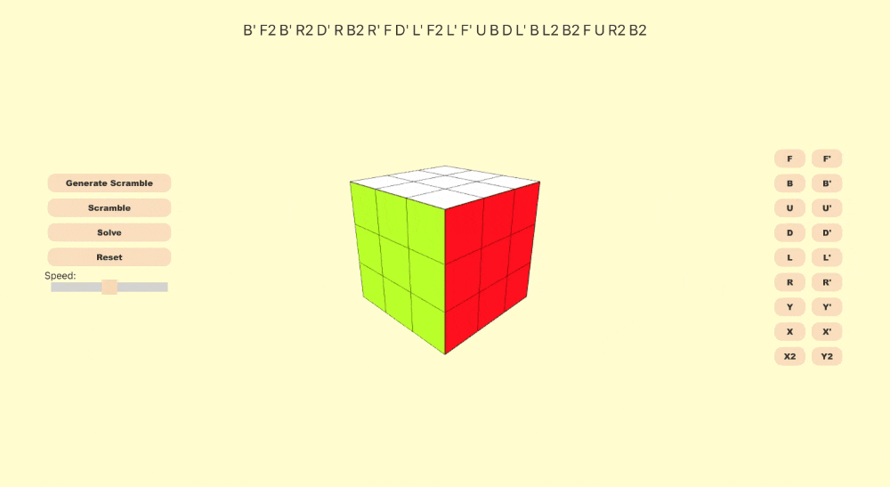

# Rubik's Cube Simulator

A Rubik's Cube simulator utilizing **Three.js** for rendering a fully functional and interactive 3D cube and **cube.js** for solving the puzzle.

## Usage

https://elisezhg.github.io/rubiks-cube-simulator/

  

